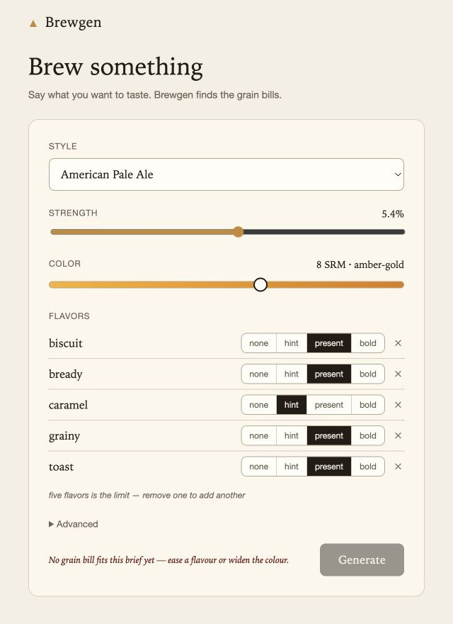
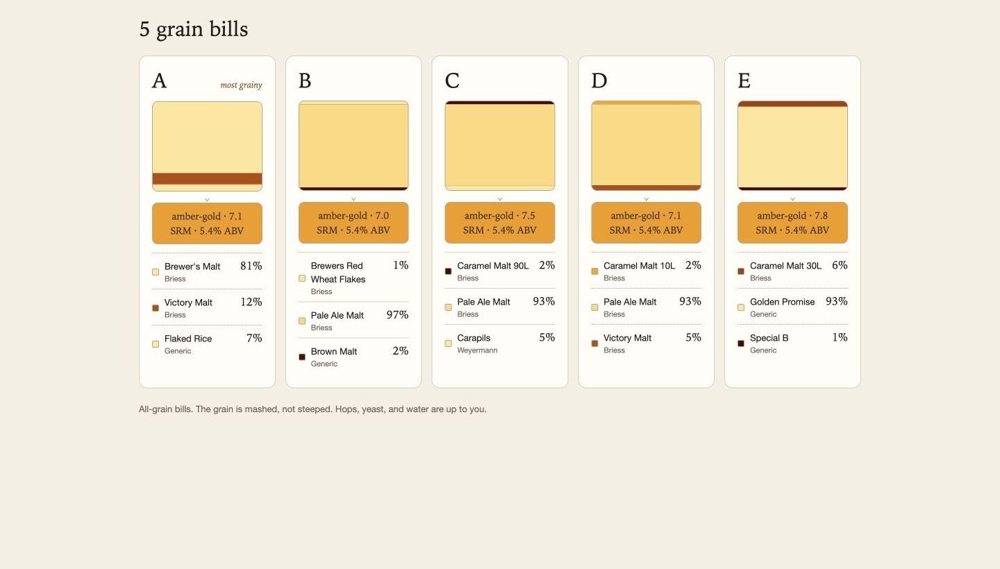

# Brewgen - Homebrew Recipe Generator

A web application for generating beer recipes based on desired flavor characteristics rather than selecting ingredients manually.

[Try Brewgen](https://brewgen.connorcg.com) · [Support this project on GitHub Sponsors](https://github.com/sponsors/ConnorGriffin)

## Overview
This is still a major work-in-progress and was built as a way for me to learn Flask, Node, Vue, and how to put it all together into a web application.

Brewgen uses per-style aggregate models combined with the BJCP 2015 guidelines to generate grain bills. For fermentables, the models capture average fermentable type (Pale 2-Row, Maris Otter, Vienna, etc.) and category (Base, Munich, Caramel, Roasted, etc.) usage, combined with maltsters' sensory descriptors to build a flavor profile per style. For example, the American IPA model shows a Bready range of 0–2.13 out of 5, mean 0.66. Requesting an American IPA with Bready '>2.0' yields grain bills that lean on Golden Promise and Munich malts.

**Style model provenance:** The current style models are legacy derived artifacts produced from a corpus scraped from BeerSmith Recipes and Brewers Friend. The raw corpus is not in this repository and cannot be recovered; the models are not currently reproducible or rights-cleared. See [`recipe_analyzer/PROVENANCE.md`](recipe_analyzer/PROVENANCE.md) for full disclosure.

## Live App

Choose a beer style, strength, color, and flavor profile at [brewgen.connorcg.com](https://brewgen.connorcg.com).

Generate five grain bills that fit the brief, then compare their ingredients and proportions.

## Project Status

The grain bill generator is live as a public alpha. Future work includes Hop and Yeast modules, saving and sharing recipes, and exporting to BeerXML or other supported formats.

The current public interface accepts up to five flavor preferences and returns five grain bills for comparison. It generates fermentables only; hops, yeast, and water remain up to the brewer.
